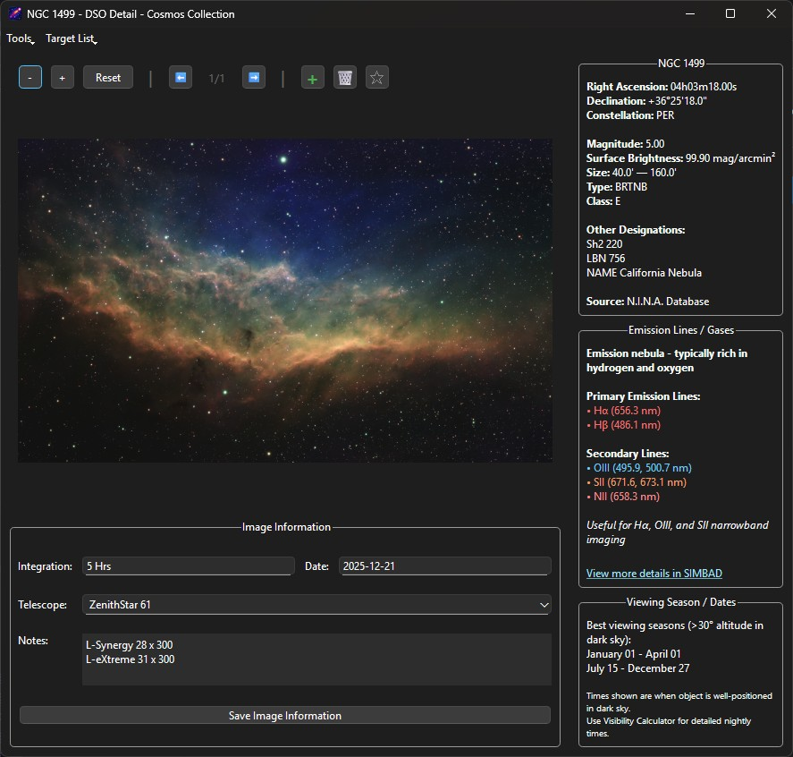
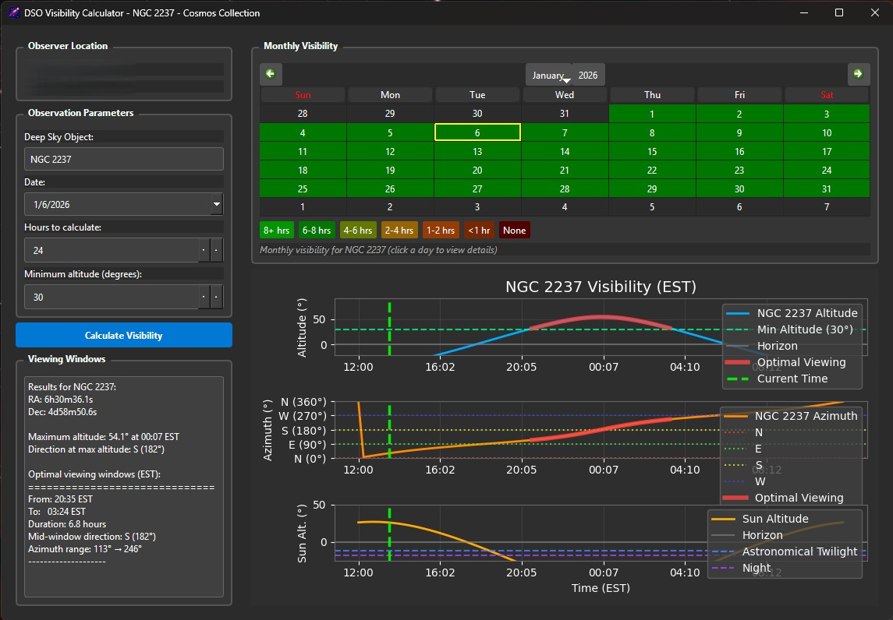
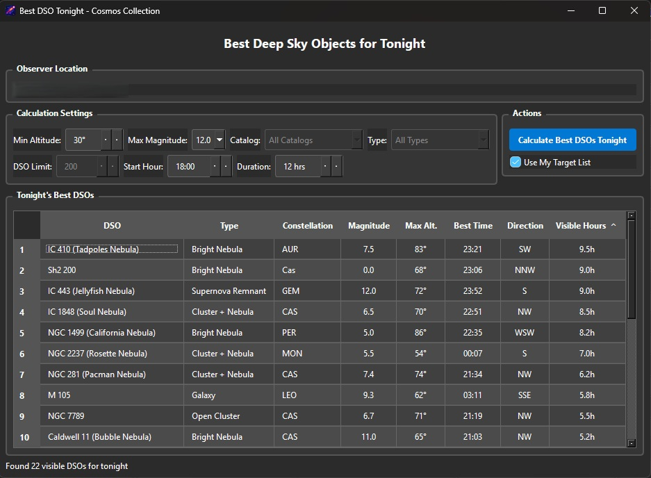
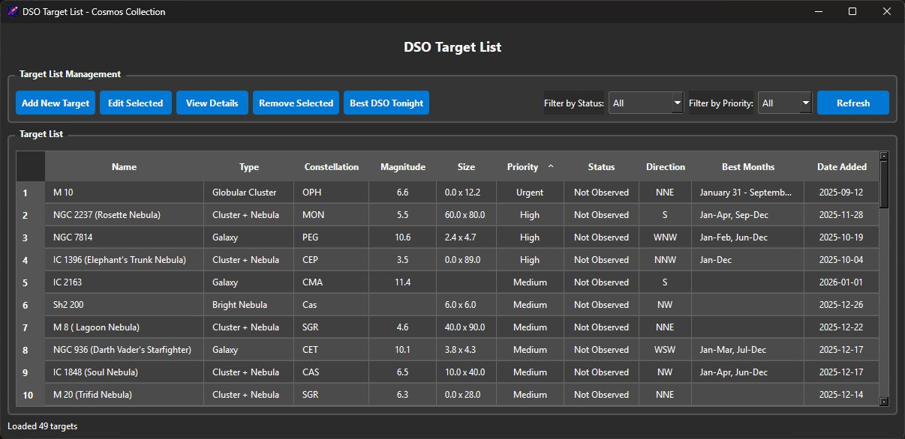
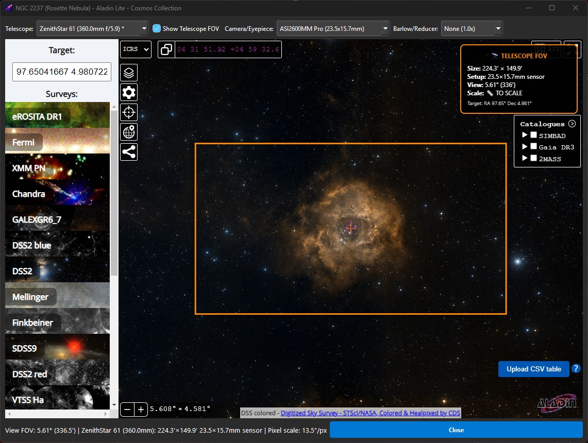
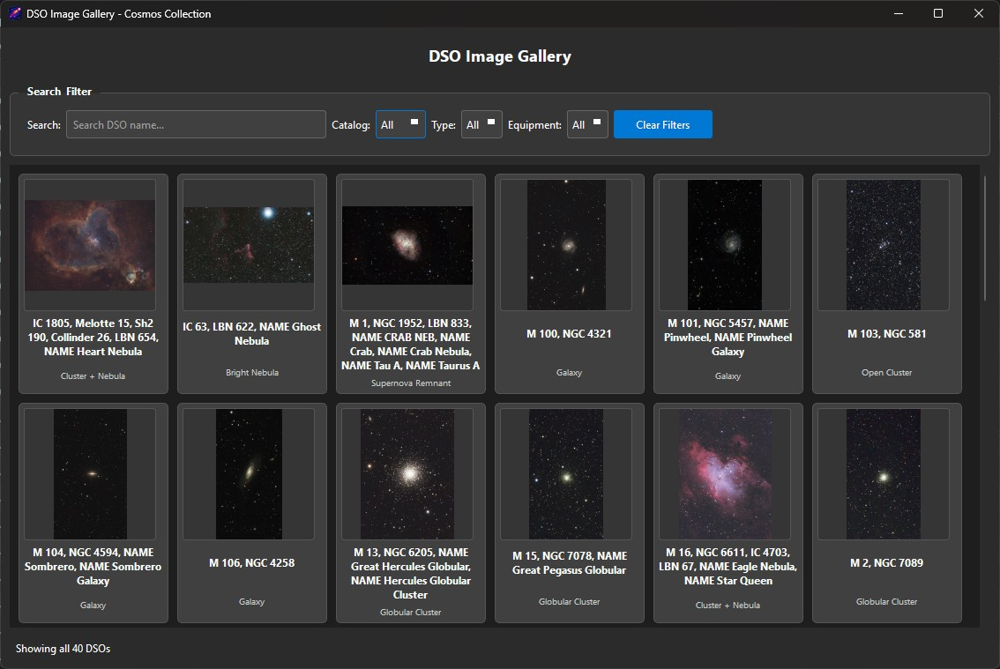
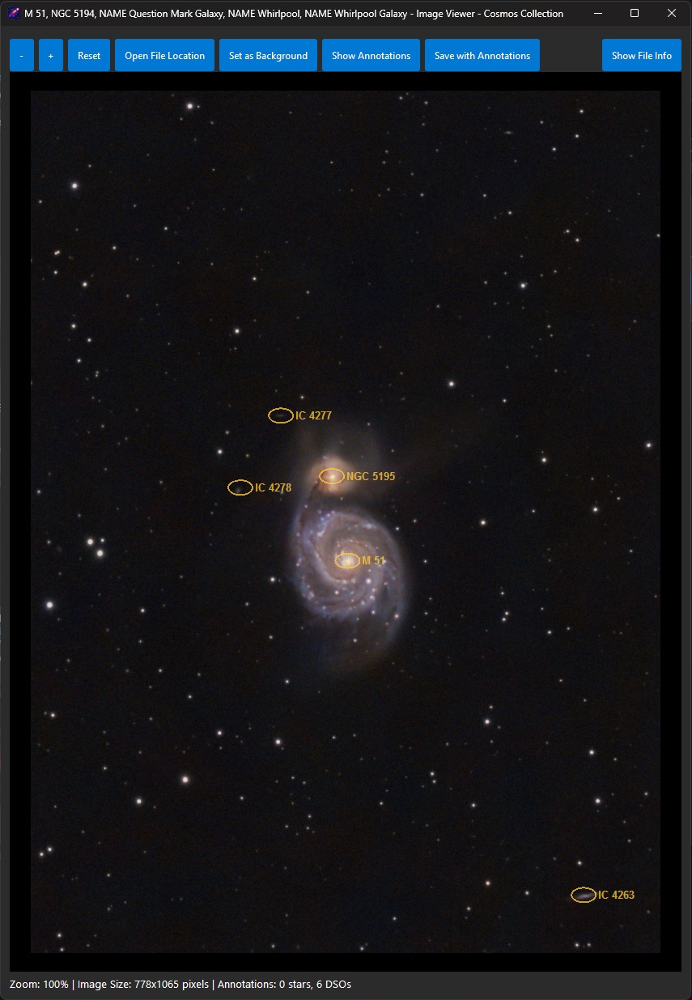
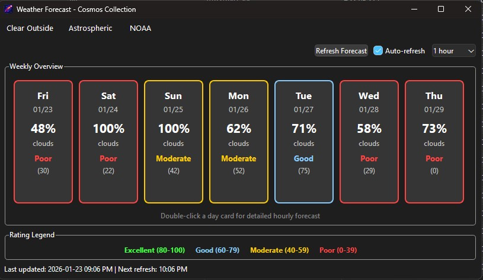
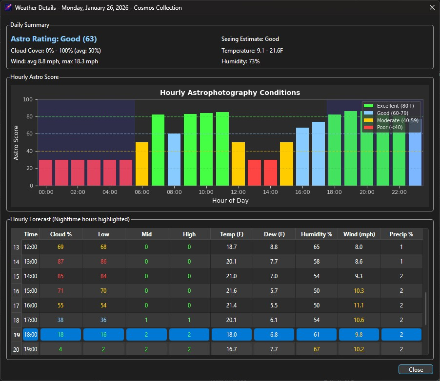

# Cosmos Collection

A personal astrophotography catalog and session planning tools for organizing and exploring your celestial images.

## Overview

Cosmos Collection is designed to help astrophotographers manage their image collections with features tailored specifically for astronomical photography. Keep track of your deep sky objects, planetary shots, and wide-field captures all in one place.

## Features

- **Image Catalog**: Organize your astrophotography images with metadata
- **Search & Filter**: Find images by object type, date, equipment, or other criteria
- **Image Data Management**: Track technical details like exposure settings, equipment used, and capture conditions
- **DSO Visibility Calculator**: Used to determine when DSOs are optimally visible
- **Best DSO Tonight**: Calculates and displays the best Deep Sky Objects visible from user's location tonight
- **DSO Target List**: DSO Target management list for planning observing sessions.
- **Telescope FOV Simulator**: Visualize future astrophotography sessions and what equipment to use.
- **Collage Builder**: Create collages of your DSO images.
- **Image Gallery**: View all your images in a gallery view. (With filters)
- **Weather Forecast**: 7 day weather forecast with astro related scoring. The weather detail window shows hourly forecast per day. 

## Screenshots
  ### DSO Detail
  

  ### DSO Visibility Calculator
  

  ### Best DSO Tonight
  

  ### DSO Target List
  

  ### Telescope FOV Simulator (Aladin-Lite)
  

  ### DSO Image Gallery
  

  ### Image Viewer
  

  ### Weather Overview
  

  ### Weather Details
  

## Getting Started

### Download Latest Release

1. Go to the [Releases](https://github.com/quake101/CosmosCollection/releases) page
2. Download the latest version for your operating system:
   - Windows: `CosmosCollection-Windows.zip`
   - macOS: `CosmosCollection-macOS.zip`
   - Linux: `CosmosCollection-Linux.zip`
3. Extract the downloaded file
4. Run the application executable

#### Linux System Requirements

Before running Cosmos Collection on Linux, you need to install the required Qt system libraries:

**Ubuntu/Debian:**
```bash
sudo apt-get update
sudo apt-get install libxcb-cursor0
```

**Fedora/RHEL:**
```bash
sudo dnf install xcb-util-cursor
```

**Arch Linux:**
```bash
sudo pacman -S xcb-util-cursor
```

This is a one-time system setup required for Qt 6.5+ applications.

### Building from Source

If you prefer to build from source:

#### Prerequisites

- Python 3.x
- Required dependencies (see requirements.txt)
- **Linux only**: System Qt libraries (see Linux System Requirements above)

#### Installation

1. Clone or download the CosmosCollection project
2. Install dependencies:
   ```
   pip install -r requirements.txt
   ```
3. Run the application:
   ```
   python main.py
   ```

## Usage

Launch Cosmos Collection and start building your personal astrophotography catalog by importing your images and adding relevant metadata for each capture.

## Command Line Interface

Cosmos Collection supports command line operations for scripting and automation.

### Using the CLI

**Compiled Release:** Use the `CosmosCollection-CLI` executable included in the release:
```bash
# Windows
CosmosCollection-CLI.exe --list-dsos

# Linux/macOS
./CosmosCollection-CLI --list-dsos
```

**From Source:** Use Python directly:
```bash
python main.py --list-dsos
```

### Add an Image

```bash
# Basic usage (from source)
python main.py --add-image --dso "M31" --image "/path/to/image.jpg"

# Basic usage (compiled release)
CosmosCollection-CLI --add-image --dso "M31" --image "/path/to/image.jpg"

# With full metadata
python main.py --add-image --dso "NGC 7000" --image "/path/to/image.tif" \
    --equipment "Telescope: AT72ED, Camera: ASI2600" \
    --integration "3600" \
    --date "2024-01-15" \
    --notes "First light!" \
    --set-favorite
```

**Options:**
| Option | Description |
|--------|-------------|
| `--dso NAME` | DSO name (required) - e.g., M31, NGC 7000, IC 1396 |
| `--image PATH` | Path to the image file (required) |
| `--equipment TEXT` | Equipment used (optional) |
| `--integration SECONDS` | Integration time in seconds (optional) |
| `--date YYYY-MM-DD` | Date the image was taken (optional) |
| `--notes TEXT` | Notes about the image (optional) |
| `--set-favorite` | Set this image as the favorite for the DSO |

### Search for DSOs

```bash
# From source
python main.py --search-dso "M31"

# Compiled release
CosmosCollection-CLI --search-dso "M31"
CosmosCollection-CLI --search-dso "Orion"
CosmosCollection-CLI --search-dso "NGC 70"
```

### List All DSOs

```bash
# From source
python main.py --list-dsos

# Compiled release
CosmosCollection-CLI --list-dsos
```

### Help

```bash
# From source
python main.py --help

# Compiled release
CosmosCollection-CLI --help
```

## Contributing

This is a personal project for astrophotography organization and session planning tool. This should be viewed as a "rolling release" style project. Feel free to fork and adapt for your own use.

## License

MIT License

Copyright (c) 2025 Cosmos Collection

Permission is hereby granted, free of charge, to any person obtaining a copy
of this software and associated documentation files (the "Software"), to deal
in the Software without restriction, including without limitation the rights
to use, copy, modify, merge, publish, distribute, sublicense, and/or sell
copies of the Software, and to permit persons to whom the Software is
furnished to do so, subject to the following conditions:

The above copyright notice and this permission notice shall be included in all
copies or substantial portions of the Software.

THE SOFTWARE IS PROVIDED "AS IS", WITHOUT WARRANTY OF ANY KIND, EXPRESS OR
IMPLIED, INCLUDING BUT NOT LIMITED TO THE WARRANTIES OF MERCHANTABILITY,
FITNESS FOR A PARTICULAR PURPOSE AND NONINFRINGEMENT. IN NO EVENT SHALL THE
AUTHORS OR COPYRIGHT HOLDERS BE LIABLE FOR ANY CLAIM, DAMAGES OR OTHER
LIABILITY, WHETHER IN AN ACTION OF CONTRACT, TORT OR OTHERWISE, ARISING FROM,
OUT OF OR IN CONNECTION WITH THE SOFTWARE OR THE USE OR OTHER DEALINGS IN THE
SOFTWARE.
